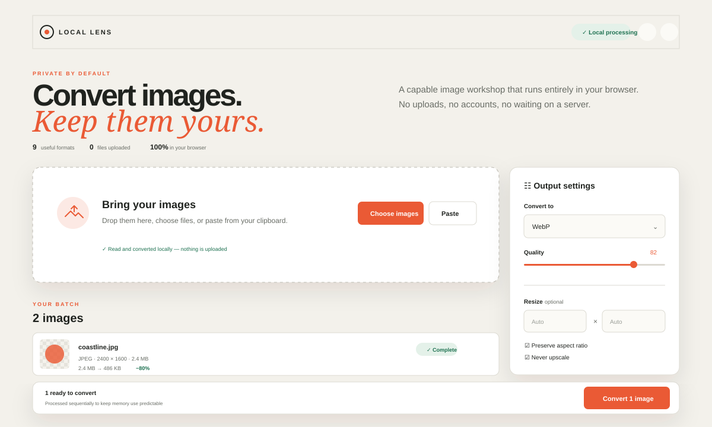

# Local Lens

**A privacy-first batch image converter that runs entirely in the browser.**

[Live demo](https://dengian.github.io/image-converter/) · [Report a bug](https://github.com/DenGian/image-converter/issues/new/choose) · [Contribute](CONTRIBUTING.md)



Local Lens converts, resizes, and prepares images without a backend. Files are decoded in a Web Worker, converted with WebAssembly, and downloaded directly by the browser. Nothing is uploaded; there are no accounts, analytics, trackers, or conversion servers.

## Features

- Drag-and-drop, file picker, and clipboard paste input
- Content-based format detection instead of trusting file extensions
- Safe sequential batch queue with queued, converting, complete, failed, and cancelled states
- Per-file input preview, detected format, dimensions, size, progress, warnings, and output preview
- Global output format and lossy quality controls
- Width/height resize, aspect-ratio preservation, contain/cover behaviour, and never-upscale mode
- Configurable transparency background for formats without alpha
- Automatic EXIF orientation correction and privacy-first metadata stripping
- Collision-safe filenames, individual downloads, and ZIP download for completed batches
- Before/after byte size and percentage change
- Light and dark themes with system preference and remembered choice
- Responsive layouts, keyboard access, visible focus, live status announcements, and reduced-motion support
- Conservative limits: 30 files, 50 MB per file, and 40 decoded megapixels

## Verified format support

This table comes from the same capability definitions used by the interface. Every advertised output has a codec integration test for magic bytes, non-empty output, and dimensions.

| Format      | Input | Output | Alpha | Notes                                                               |
| ----------- | :---: | :----: | :---: | ------------------------------------------------------------------- |
| JPEG / JPG  |   ✓   |   ✓    |   —   | Lossy quality control; transparent pixels use the chosen background |
| PNG         |   ✓   |   ✓    |   ✓   | Lossless                                                            |
| WebP        |   ✓   |   ✓    |   ✓   | Lossy quality control                                               |
| AVIF        |   ✓   |   ✓    |   ✓   | Lossy quality control; encoding is CPU intensive                    |
| GIF         |   ✓   |   ✓    |   ✓   | First frame only; output is static                                  |
| BMP         |   ✓   |   ✓    |   —   | Uncompressed/large output; transparency is flattened                |
| TIFF / TIF  |   ✓   |   ✓    |   ✓   | First page only; browser preview may be unavailable                 |
| HEIC / HEIF |   ✓   |   —    |   ✓   | Input-only; tested against a repository HEIC fixture                |
| ICO         |   —   |   ✓    |   ✓   | Output-only; images larger than 256 px are reduced to fit           |

SVG is intentionally excluded. Safely rasterising arbitrary SVG requires a sanitisation and resource-loading policy that this release does not pretend to provide; embedded scripts and remote references must never be executed accidentally. JPEG XL is also excluded because the selected distributed codec and target browsers did not provide a dependable tested path.

## Important limitations

- **Animation and multiple pages:** only the first GIF frame, HEIF image, or TIFF page is converted. Local Lens inspects the container and warns before conversion when multiple frames/pages are detected.
- **Metadata:** stripping is on by default. Turning it off asks the codec to retain profiles, but format changes can still discard or rewrite unsupported metadata.
- **Colour:** embedded profiles may not survive cross-format conversion. Output is intended for common browser/sRGB workflows, not colour-critical prepress.
- **Memory:** compressed file size can be tiny compared with decoded RGBA memory. The limits and sequential queue reduce risk, but a browser tab can still run out of memory on constrained devices.
- **Cancellation:** cancelling terminates the codec worker. A synchronous WASM encoder cannot report smooth byte-level progress, so displayed progress represents pipeline stages.
- **Preview:** browsers do not natively display every valid output, particularly TIFF. The file remains downloadable when inline preview is unavailable.

## Architecture

```text
React UI → validation / queue → module Web Worker → typed codec adapter
                                                   ↓
                              lazy ImageMagick WASM → output Blob / ZIP
```

- React and strict TypeScript own accessible state and controls.
- `src/formats.ts` is the single source of truth for the UI, MIME types, extensions, and documentation matrix.
- `src/codecs/workerClient.ts` isolates worker lifecycle, cancellation, messages, and progress.
- `src/codecs/magickAdapter.ts` keeps ImageMagick-specific operations behind typed conversion functions.
- `src/lib/` contains independently tested detection, filenames, resizing, validation, and queue logic.
- Vite's `base: '/image-converter/'` and `?url` WASM import produce Pages-safe worker and asset paths.

The codec spike selected [`@imagemagick/magick-wasm`](https://github.com/dlemstra/magick-wasm) 0.0.43. It gives one consistent orientation/resize/alpha/metadata pipeline and broad tested format coverage. Focused `@jsquash/*` codecs were smaller per format but required several additional libraries for GIF, BMP, TIFF, ICO, and HEIC. See the full [codec decision record](docs/codec-decision.md).

The trade-off is a large lazy asset: the verified production build emits about **14.8 MB raw / 5.34 MB gzip** of WASM, plus about **195 kB** of worker JavaScript. The main application JavaScript is about **249 kB raw / 78 kB gzip**; the **96 kB** ZIP chunk also loads only when needed. The codec is not loaded until the first image is inspected.

## Local development

Requirements: Node.js 22 or newer and npm.

```bash
git clone git@github.com:DenGian/image-converter.git
cd image-converter
npm ci
npm run dev
```

The development server prints its local address. The application path remains `/image-converter/` to match production.

## Commands and testing

```bash
npm run format:check  # Prettier verification
npm run lint          # ESLint
npm run typecheck     # strict TypeScript project build
npm test              # unit, component, and codec integration tests
npm run test:codec    # distributed-WASM fixture tests only
npm run build         # production output in dist/
npm run preview       # serve the production build
npm run test:e2e      # Playwright production-path smoke test
```

The test suite covers format sniffing and capabilities, collision-safe names, resize maths, resource limits, queue transitions, human-readable sizes, alpha flattening, EXIF orientation, corrupted input, HEIC decode, every output encoder, component success/failure states, multi-frame warnings, and a real browser conversion/download under `/image-converter/`.

Install Chromium once if Playwright has not done so:

```bash
npx playwright install chromium
```

## Production and GitHub Pages

Build locally with `npm run build`. The static output is `dist/`; no server-side runtime or environment variable is required.

The repository includes a least-privilege Pages workflow that builds from the lockfile, uploads `dist`, and deploys it with concurrency protection. The owner must do this once:

1. Open **Settings → Pages** in the GitHub repository.
2. Under **Build and deployment**, set **Source** to **GitHub Actions**.
3. Push the finished changes to `main`, or run **Deploy to GitHub Pages** manually from the Actions tab.

The expected URL is <https://dengian.github.io/image-converter/>.

CI separately runs formatting, lint, typechecking, all Vitest suites, the production build, and Playwright. Official GitHub Actions are pinned to immutable release SHAs and Dependabot checks both npm and Actions weekly.

## Browser support

Current stable Chrome/Edge, Firefox, and Safari are the target. The browser must support module workers, WebAssembly, `File`/`Blob`, object URLs, and modern ES2022 JavaScript. HEIC decoding uses WASM rather than relying on native browser display. Clipboard reading depends on browser permission and a secure context; normal paste events remain supported.

## Accessibility

Local Lens uses semantic regions, labelled controls, native progress elements, descriptive action labels, keyboard-visible focus, polite live announcements, sufficient light/dark contrast, and reduced-motion handling. Automated component coverage complements manual keyboard and responsive review.

## Security and privacy

No user image is sent over the network. The deployed app only requests its own static JavaScript, CSS, manifest, worker, and WASM assets. Object URLs are revoked when files are removed or replaced by completed outputs.

Local-only processing reduces exposure but malformed files can still target browser or codec vulnerabilities and large decoded images can exhaust memory. Read [SECURITY.md](SECURITY.md) for the reporting process and threat model. Third-party licences are summarised in [THIRD_PARTY_NOTICES.md](THIRD_PARTY_NOTICES.md).

## Contributing and licence

Contributions are welcome; start with [CONTRIBUTING.md](CONTRIBUTING.md). Local Lens is released under the [MIT License](LICENSE), copyright © 2026 DenGian.
