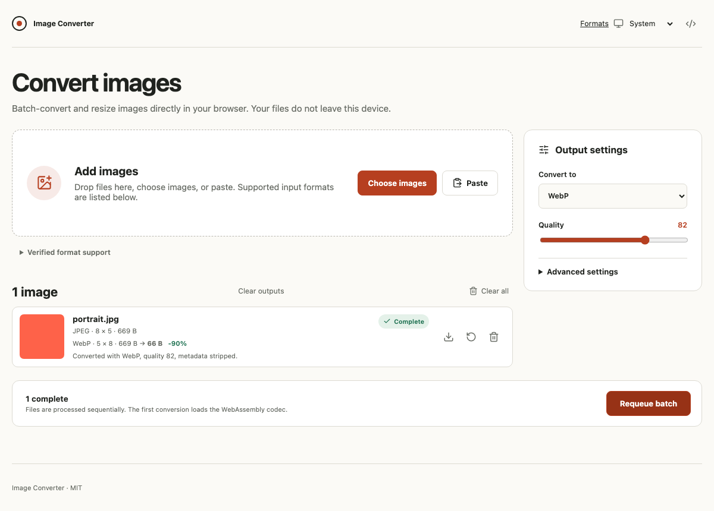

# Image Converter

Browser-based batch image conversion and resizing powered by WebAssembly and Web Workers. Files stay on the user's device.

[](https://github.com/DenGian/image-converter/actions/workflows/ci.yml) [](LICENSE)

Live demo: [image-converter-two-eta.vercel.app](https://image-converter-two-eta.vercel.app/).



## Features

- Content-based input detection, sequential batch conversion, per-file retry and reconversion
- Resize, fit, never-upscale, quality, transparency fill, and metadata controls
- Individual downloads and size-limited ZIP generation in a separate worker
- System, light, and dark themes; file picker, drop, clipboard paste, and keyboard access
- Client-side source, dimension, output, batch, and ZIP limits

## Verified support

Each advertised encoder is checked for file signature and dimensions with the distributed WASM codec. HEIC decoding uses a fixture. Animation and multiple pages are reduced to the first frame/page with a warning.

| Format      | Input | Output | Alpha | Notes                                      |
| ----------- | :---: | :----: | :---: | ------------------------------------------ |
| JPEG / JPG  |   ✓   |   ✓    |   —   | Lossy; transparency uses selected fill     |
| PNG         |   ✓   |   ✓    |   ✓   | Lossless                                   |
| WebP        |   ✓   |   ✓    |   ✓   | Lossy                                      |
| AVIF        |   ✓   |   ✓    |   ✓   | Lossy; encoding can be slow                |
| GIF         |   ✓   |   ✓    |   ✓   | Static output, first frame only            |
| BMP         |   ✓   |   ✓    |   —   | Uncompressed, potentially large            |
| TIFF / TIF  |   ✓   |   ✓    |   ✓   | First page only; preview varies by browser |
| HEIC / HEIF |   ✓   |   —    |   ✓   | Input only                                 |
| ICO         |   —   |   ✓    |   ✓   | Output only; reduced to at most 256 px     |

SVG, animated output, and multipage preservation are unsupported.

## Architecture

React owns queue state and controls. A module worker lazily loads ImageMagick WASM for inspection and conversion. A separate lazy worker assembles ZIP archives. Format capabilities live in `src/formats.ts`; resource rules live in `src/lib/validation.ts`. See [architecture](docs/ARCHITECTURE.md) and the [codec decision](docs/codec-decision.md).

## Development and verification

Node.js 22+ and npm are required.

```bash
npm ci
npm run dev
npm run format:check
npm run lint
npm run typecheck
npm test
npm run test:codec
npm run build
npm run size:check
npx playwright install chromium firefox webkit
npm run test:e2e
```

`npm run preview` serves the production build with the configured security headers for local checking. Tests inspect `vercel.json` for production cache rules. Automated accessibility checks complement manual keyboard, zoom, and contrast review.

## Vercel release

Use Vercel's Git integration with the Vite preset, `npm run build`, and `dist` output. No environment variables or server are required. The release path is feature branch → pull request → CI → Vercel preview → review → merge to protected `main` → Vercel production. Protect `main` and require CI before merge in repository settings. Deployment and remote settings changes require owner approval. Verify the production URL, worker and WASM requests, headers, download, and browser console before adding a live link or publishing v1.0.0.

## Limits and roadmap

The large WASM asset makes the first inspection slower; it is lazy loaded and cached as a hashed asset. Source files are limited to 50 MiB each and 150 MiB retained per batch; source and output pixels are capped at 40 MP, output axes at 8192 px, output blobs at 150 MiB retained, and ZIP input at 75 MiB. These are conservative browser memory guardrails, not guarantees against tab exhaustion. Output metadata and colour profiles can change across formats. Clipboard access requires browser permission; normal paste still works. Offline support is not claimed.

The [roadmap](docs/ROADMAP.md) covers offline support and separately researched server processing after v1. Browser processing never uploads silently.

## Contributing and license

See [contributing](CONTRIBUTING.md), [security](SECURITY.md), and [third-party notices](THIRD_PARTY_NOTICES.md). Licensed under [MIT](LICENSE).
